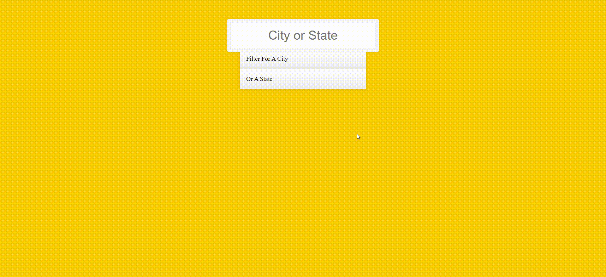

# Auto Complete Input

> This project is a part of our dev-club activity and will focus on pair programming. In this Challenge you will to explain your partner what to code without telling him how to code it.

---

### Table of Contents

- [Challenge Languages](#Languages)
- [Instructions](#Instructions)
- [Preview](#Preview)

---

## Languages

* HTML
* CSS
* JS

---

## Instructions

- [ ] Find A Partner
- [ ] Only one of you can read the following instructions
- [ ] Look at the following gif and create short spesifcati0on for an application that match the functionality presented. ( you have 15 minuets to complete this task )
- [ ] Present your partner with your spesifcation (verbly) and hope he will be able to solve it. ( you have 10 minuets to explain your partner what to do ) 

---

## Preview

